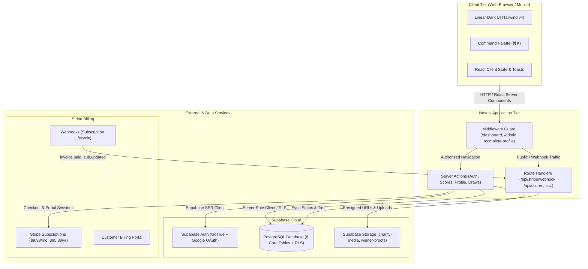
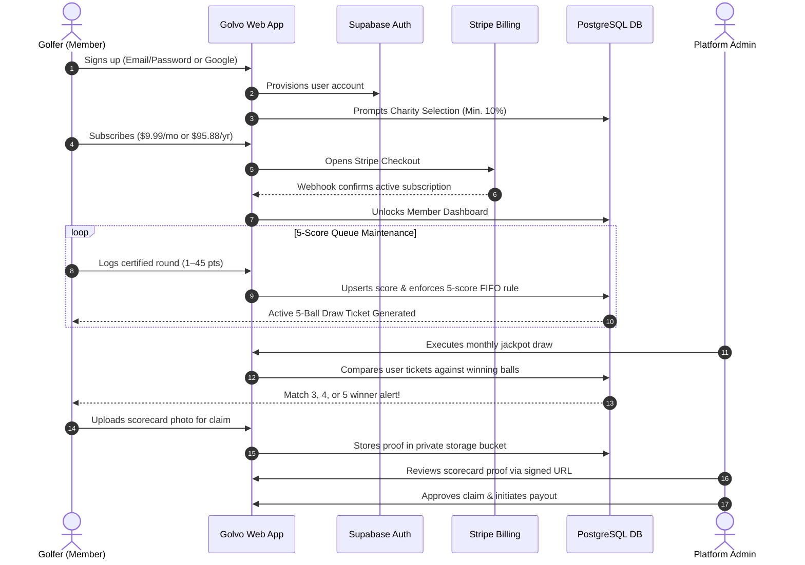
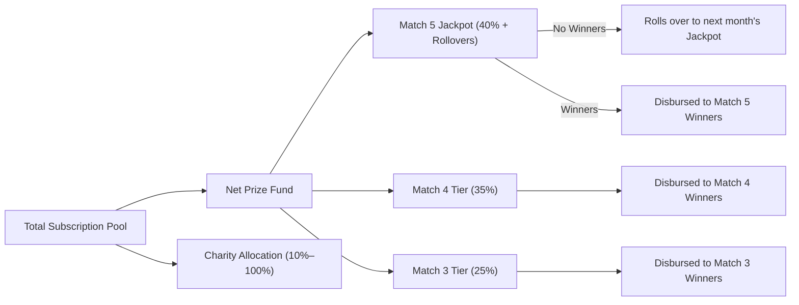
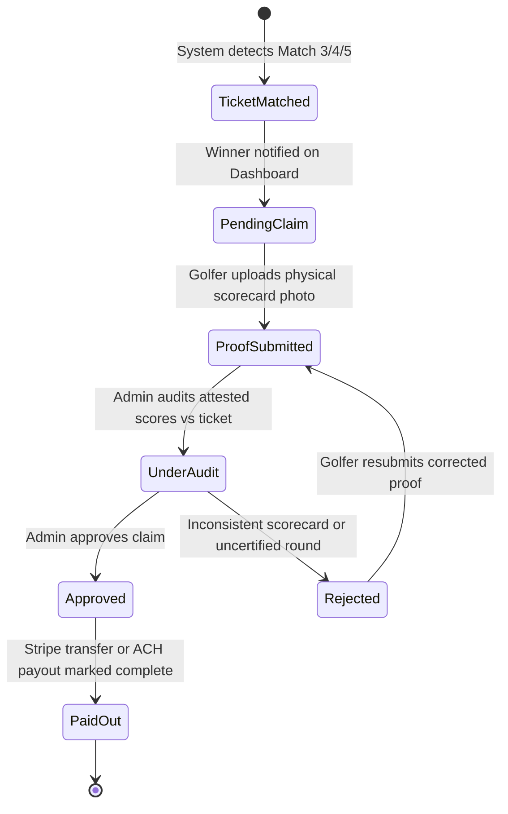
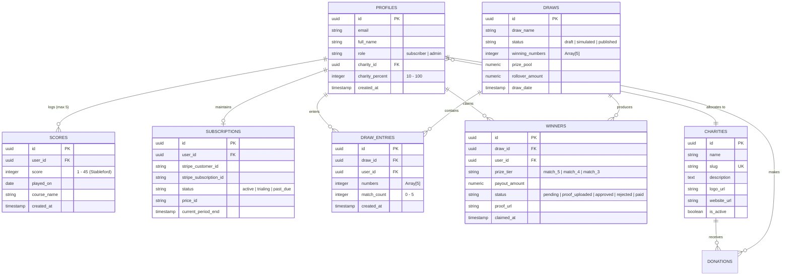

# Golvo

<div align="center">

```
   ____      ___      __     __    __   ____
  / ___| ___ | | \   /\ \   / /__  \ \ / /  _ \
 | |  _ / _ \| |  \ / /\ \ / / _ \  \ V /| | | |
 | |_| | (_) | |   V /  \ V / (_) |  | | | |_| |
  \____|\___/|_|    /    \_/ \___/   |_| |____/
```

### The Premier Golf Performance Tracking & Monthly Charity Jackpot Platform

[](https://nextjs.org/)
[](https://tailwindcss.com/)
[](https://supabase.com/)
[](https://stripe.com/)
[](https://playwright.dev/)

---

**Golvo** merges real-world golf performance tracking with automated lottery-style charity jackpots. Golfers log their certified Stableford rounds, maintain a rolling 5-score handicap ticket, and automatically participate in monthly cash draws that fund registered 501(c)(3) charities.

</div>

---

## 📖 Table of Contents

1. [Executive Summary](#-executive-summary)
2. [Core Platform Pillars](#-core-platform-pillars)
3. [System Architecture](#-system-architecture)
4. [User Journeys & Lifecycle Flow](#-user-journeys--lifecycle-flow)
5. [Core Engine & Business Logic](#-core-engine--business-logic)
   - [The Stableford 5-Score Rolling Engine](#1-the-stableford-5-score-rolling-engine)
   - [The Monthly Draw & Jackpot Engine](#2-the-monthly-draw--jackpot-engine)
   - [The Charity Give-Back Mechanism](#3-the-charity-give-back-mechanism)
   - [Scorecard Audit & Verification Pipeline](#4-scorecard-audit--verification-pipeline)
6. [Platform Modules & Feature Map](#-platform-modules--feature-map)
7. [Database Architecture & Entity Relationships](#-database-architecture--entity-relationships)
8. [Security, Access Control & Compliance](#-security-access-control--compliance)
9. [UI/UX Design Philosophy](#-uiux-design-philosophy)

---

## 🎯 Executive Summary

Traditional golf apps track handicaps in isolation, while charity lotteries require manual ticket purchasing disconnected from personal sporting achievements.

**Golvo bridges this gap:**
- **Your Golf Game Is Your Ticket**: Golfers play their normal weekend or competition rounds and record their Stableford score (1–45 points).
- **Rolling 5-Score Queue**: A golfer's most recent 5 certified rounds automatically form their 5-number entry ticket for the monthly draw.
- **Philanthropy Built-In**: 10% to 100% of every member's subscription is routed directly to non-profit organizations supporting youth access, veteran rehabilitation, and ecological preservation.
- **Audited Cash Jackpots**: Unclaimed jackpots roll over month-to-month, with automated tier distributions for Match 3, Match 4, and Match 5 winners verified against official physical scorecards.

---

## 🌟 Core Platform Pillars

```
┌─────────────────────────────────────────────────────────────────────────────┐
│                                 GOLVO                                       │
└──────────────┬──────────────────────────────┬───────────────────────────────┘
               │                              │
               ▼                              ▼
     ┌──────────────────┐           ┌──────────────────┐
     │ 🏌️ GOLF GAME     │           │ 💖 CHARITY       │
     │  - Stableford    │           │  - 10%–100% fee  │
     │  - 5-Score Queue │           │  - Youth / Vets  │
     │  - Anti-Sandbag  │           │  - Direct Impact │
     └─────────┬────────┘           └─────────┬────────┘
               │                              │
               └──────────────┬───────────────┘
                              │
                              ▼
                    ┌──────────────────┐
                    │ 🎟️ JACKPOT DRAW   │
                    │  - Match 3, 4, 5 │
                    │  - Rollover Pool │
                    │  - Audit Claims  │
                    └──────────────────┘
```

1. **Precision Performance**: Automatic retention of the latest 5 verified rounds prevents stale tickets and eliminates handicapping manipulation.
2. **Effortless Philanthropy**: Members choose their primary cause during onboarding and can adjust their allocation slider anytime from 10% up to 100%.
3. **Transparent Odds & Fairness**: Draws support both pure cryptographic pseudo-random generation and community frequency-weighted algorithmic distributions.
4. **Verifiable Audit Trail**: High-tier winners must submit physical scorecard evidence reviewed by compliance administrators before payout disbursement.

---

## 🏗️ System Architecture

Golvo is built on Next.js App Router, using Server Actions, Middleware session validation, PostgreSQL Row Level Security (RLS), and Stripe webhook synchronization.



---

## 🔄 User Journeys & Lifecycle Flow

### 1. The Golfer Journey



---

## ⚙️ Core Engine & Business Logic

### 1. The Stableford 5-Score Rolling Engine

The core foundation of Golvo is the **Modified Stableford scoring format**, standardized between 1 and 45 points per 18-hole round:

```
Score Entry (1–45)  ───►  [ Round 1 ] [ Round 2 ] [ Round 3 ] [ Round 4 ] [ Round 5 ]
                                │                                            │
                                └────────────────────┬───────────────────────┘
                                                     ▼
                                        Active 5-Number Draw Ticket
```

- **Retention Constraint**: Every golfer retains **exactly 5 active scores**.
- **FIFO Replacement Trigger**: When a 6th round is submitted, the database trigger automatically purges the oldest score by `played_on` date.
- **Integrity Validation**:
  - Scores strictly limited to integer values between `1` and `45`.
  - Duplicate rounds on the same calendar date for the same user are rejected.
  - Handicap differential indexing is recorded alongside course rating and slope.

---

### 2. The Monthly Draw & Jackpot Engine

On the final day of each calendar month, Golvo executes the official draw.



#### Draw Execution Modes
1. **Random Generator**: Selects 5 distinct numbers between 1 and 45 using cryptographically secure entropy.
2. **Algorithmic Generator**: Selects winning numbers weighted by community scoring distributions:
   - `most-frequent`: Biased toward balls matching the common handicapping clusters.
   - `least-frequent`: Rewards outlier high/low handicappers.

#### Prize Pool Distribution Formula
$$\text{Net Prize Pool} = \text{Gross Subscription Revenue} - \text{Charity Allocations} - \text{Platform Reserve}$$

- **Match 5 (Jackpot)**: **40%** of net pool + accrued rollover balance.
- **Match 4 (Tier 2)**: **35%** of net pool distributed equally among all 4-ball matches.
- **Match 3 (Tier 3)**: **25%** of net pool distributed equally among all 3-ball matches.

---

### 3. The Charity Give-Back Mechanism

Golvo is fundamentally built to create sustainable, recurring funding for golf-centered and community non-profits.

```
       Member Subscription ($9.99/mo)
                     │
    ┌────────────────┴────────────────┐
    ▼                                 ▼
Default Charity Share (10%)     Golfer Discretionary Add-on (Up to 90%)
  [$1.00 / month]                 [Up to $9.00 / month]
    │                                 │
    └────────────────┬────────────────┘
                     ▼
          Total Charity Allocation
        (Selected Partner 501(c)(3))
```

- **Guaranteed Baseline**: A minimum of 10% of every active subscription is earmarked for charity.
- **User Discretionary Slider**: Golfers can set their contribution from 10% up to 100% through the interactive charity slider in `/dashboard/charity`.
- **Beneficiary Partners**:
  - *Youth on Course*: Subsidizing rounds for junior golfers under 18.
  - *First Tee Foundation*: Character development and life skills through golf.
  - *PGA HOPE*: Rehabilitating military veterans through developmental clinics.
  - *Adaptive Golf Association*: Specialized equipment for individuals with physical challenges.
  - *Save the Greens Trust*: Environmental stewardship and pollinator sanctuaries on golf courses.

---

### 4. Scorecard Audit & Verification Pipeline

To maintain jackpot integrity and prevent fraudulent score submission, Golvo implements a compliance verification protocol:



1. **Proof Storage**: Scorecard images are stored in a private Supabase Storage bucket (`scorecard-proofs`).
2. **Zero Public Access**: Buckets are inaccessible to the public; only authenticated admins can generate temporary signed URLs (expiring in 15 minutes) for review.
3. **Audit Criteria**: Admin checks player name, attested markers, handicap verification, and round date against the logged score.

---

## 🖥️ Platform Modules & Feature Map

### 1. Public & Marketing Surface
- **Hero & Value Proposition**: Interactive product preview, real-time prize pool counter, and social proof.
- **Charities Directory (`/charities`)**: Public directory with instant name search, cause categorization, and detail pages (`/charities/[slug]`) featuring upcoming volunteer events.
- **Transparent Pricing (`/pricing`)**: Clear pricing breakdown ($9.99/mo or $95.88/yr) showing the exact dollar split between prize pool and charity give-back.

### 2. Golfer Experience (`/dashboard`)
- **Performance Overview**: Current 5-score average, rolling trend sparklines, and active charity allocation indicator.
- **5-Score Manager (`/dashboard/scores`)**:
  - Live 5-ball ticket display with certified round badges.
  - Score entry modal with input constraints, course slope/rating, and date picker.
  - Inline score deletion and history timeline.
- **Charity Give-Back Center (`/dashboard/charity`)**: Interactive slider (10% to 100%) calculating immediate annual impact, charity selection switcher, and one-off donation support.
- **Winnings & Claims Center (`/winnings`)**: Historic draw results, ticket match verification, and scorecard proof upload interface.

### 3. Command Palette (`⌘K` / `Ctrl+K`)
- Integrated Raycast/Linear-style command palette available globally across dashboard and admin areas.
- Category filters: *Views*, *Actions*, *Charity*, *Prizes*, and *Settings*.
- Instant keyboard navigation with arrow keys and `Enter` execution.

### 4. Administration Console (`/admin`)
- **Analytics & Platform KPIs**: Total platform revenue, active subscribers, aggregate charity contributions, and prize pool history charts.
- **User Directory (`/admin/users`)**: Searchable directory with role management (`subscriber` vs `admin`) and direct score management.
- **Draw Management (`/admin/draws`)**:
  - Simulated draw runner with instant winner previews and rollover calculation.
  - Official one-click publishing lock.
- **Charity Partner Portal (`/admin/charities`)**: CRUD management of charity partners, logo/banner uploads, and community events scheduling.
- **Claims Verification Desk (`/admin/winners`)**: Audit table displaying claimant information, prize tier, secure scorecard image viewer, and approve/reject controls.

---

## 🗄️ Database Architecture & Entity Relationships

The relational schema is built on PostgreSQL with Row Level Security (RLS) enforcing strict tenant boundaries.



---

## 🛡️ Security, Access Control & Compliance

| Layer | Implementation Strategy |
|---|---|
| **Row Level Security (RLS)** | Enabled on all tables. Golfers can only read and mutate their own scores, tickets, and profiles. |
| **Admin Route Protection** | Dual-gated via Next.js Middleware and Supabase Service Role queries. Non-admins visiting `/admin` are immediately redirected with an unauthorized warning. |
| **Sensitive Proof Storage** | Winner scorecards are isolated in non-public storage. Only pre-signed, short-lived URLs are generated for authenticated administrative auditing. |
| **Payment Webhook Verification** | Stripe webhooks validate cryptographic signatures via `STRIPE_WEBHOOK_SECRET` before updating subscription states. |
| **Input Validation** | All inputs (scores, charities, profiles, passwords) are validated with strict **Zod schemas** on both client and server before execution. |

---

## 🎨 UI/UX Design Philosophy

Golvo follows a **Linear-inspired high-density dark aesthetic**:

- **Color Palette**: Pitch black background (`#08090A`), surface elevation cards (`#0F1011`), hairline border rings (`rgba(255, 255, 255, 0.08)`), and electric violet accents (`#5E6AD2`).
- **Micro-Interactions**: Ambient radial glow accents, subtle hover lifts, interactive doodle buttons (`BackStarButton`), and toast alerts for every transactional state.
- **Keyboard-First**: Global Command Palette accessible via `⌘K` / `Ctrl+K` with real-time fuzzy search.
- **Responsive Layout**: Fluid flex/grid architecture with an edge-to-edge drawer navigation for mobile viewports, guaranteed zero horizontal overflow.
- **Accessibility**: Audited against **WCAG 2.x AA** standards using `@axe-core/playwright`.

---

<div align="center">

**Golvo Platform** — Engineered for golfers who play for the score, the prize, and the cause.

*Copyright © 2026 Golvo. All rights reserved.*

</div>
